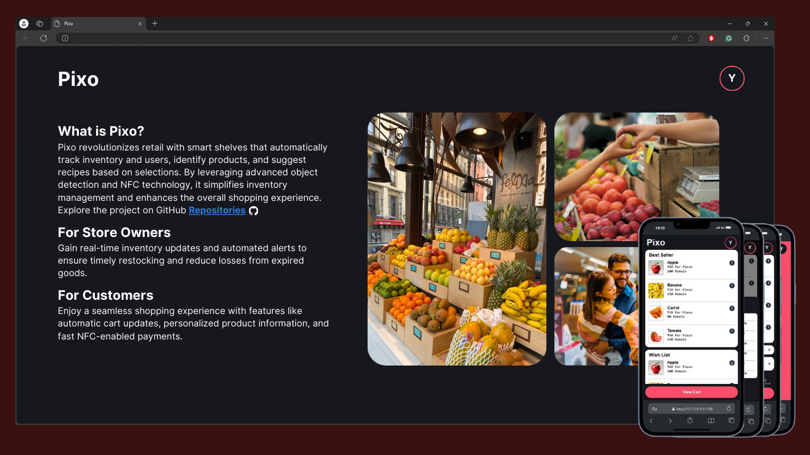

# Smart Store System

This project is a comprehensive **Smart Store System** that uses a Python-based backend and a web-based frontend for managing inventory, enhancing user experience, and simplifying payment processes. The system is designed to automate store-side operations and offer customers a seamless shopping experience with minimal manual intervention.



## Project Overview

The Smart Store System is built around three key components:


1. **Store-Side System**: Cameras identify grocery items (like apples, non-food products, foodstuffs, and drinks) and track essential information such as expiration dates, product name, storage date, and price. The system sends alerts to the store owner about expiring items for better inventory management.
   
2. **User-Side Application**: A web-based application where items picked by the user are automatically added to a virtual cart. The app displays benefits and drawbacks of the products and suggests recipes based on the items in the cart.
   
3. **Automated Payment System**: An NFC-based payment method allows users to pay seamlessly as they leave the store, without scanning or manual input. The total amount is automatically deducted, and a digital receipt is sent to the user via the app and email.

## Features

- **Real-time Item Detection**: Automatically detects and classifies grocery items on shelves using object recognition.
- **Inventory Monitoring**: Tracks item stock levels, expiration dates, and provides alerts to the store owner.
- **Virtual Cart**: Automatically adds items to the user's cart as they pick them up.
- **Product Info & Suggestions**: Displays detailed product information and suggests recipes based on selected items.
- **Seamless Checkout**: Tap-and-pay using NFC-enabled devices, with automatic receipt generation.
- **Store Management Alerts**: Notifications for items nearing expiration, helping optimize stock rotation. 

<p align="center">
 
  
  
  
  
</p>


## Technology Stack

- **Backend**: Python (Django framework)
- **Frontend**: HTML, CSS, JavaScript
- **Object Detection**: OpenCV and TensorFlow
- **Database**: MySQL/PostgreSQL
- **Payment Integration**: NFC Technology

## Installation & Setup

### Prerequisites

Ensure you have the following installed:
- Python 3.x
- Django
- MySQL or PostgreSQL
- Node.js (optional for frontend management)

### Steps
1. **Requirement**:<br>
   Download this library 
   ```bash
   pip install torch torchvision pillow opencv-python yolov5

2. **Clone the Repository**:
   ```bash
   git clone https://github.com/YOUR_USERNAME/smart-store-system.git
   cd smart-store-system